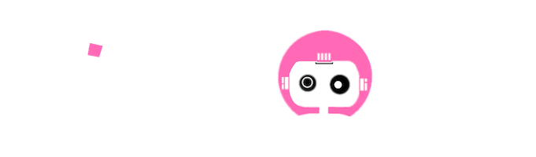

<br clear="both"/>

This is a fun project Where AI model of your choice generates a pink robot image. You make a short/long description of your robot, AI generates it and if you like your robot, you can mint it as NFT on Astar Network. The NFT contract is minted as Native (WASM) contract and it uses PSP34 standard. 

The NFTs are visible at the Paras marketplace. The cost of minting is 1 ASTR pet NFT plus gas and storage fee.
## The project website
[PinkRobot.me](https://www.pinkrobot.me/)

## Contract Deployment
The pink-robot contracts are deployed on [Astar Networks](https://astar.network/) at the following addresses:
```
---
```
Its metadata can be [found here](./frontend/src/metadata.json).

## 🤔 Why?

Just for fun
